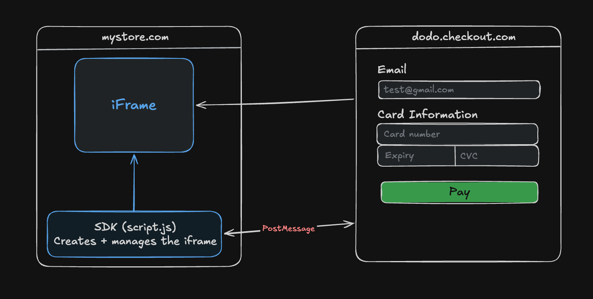

# Dodo Payments - Tiny Embeddable Checkout

A tiny embeddable checkout that merchant can add to its website. Customers pay without leaving the merchants's page, while the merchant never handles their card details.

Live demo - https://demo-site-liart-theta.vercel.app

<br/>

## 👀 What's in this project

### 1. Checkout

The checkout that customers see when they pay.
<br/>
This is the where the customer types their email and card details and pay.
<br/>
https://app-seven-zeta-6ckoa86wu0.vercel.app

### 2. SDK

The SDK that merchants add to their website using a `<script>` tag. The SDK is written in TypeScript, split across a few small files.
<br/>
`esbuild` bundles and minifies it in `public/script.js`
<br/>
https://app-seven-zeta-6ckoa86wu0.vercel.app/script.js

### 3. Demo site

A demo site to show the checkout in action. It has one product, a Buy button, and a log at the bottom that shows what is happening during the checkout flow.
<br/>
https://demo-site-liart-theta.vercel.app

<br/>

## 🧑‍💻 Running locally

- Start the **Checkout** and **SDK**

```
cd app
npm i
npm run dev
```

- Start the **Demo site**

```
cd demo-site
npm i
npm run dev
```

> The demo site uses the deployed checkout by default. <br/>
> To test the checkout locally, point the demo site to your local checkout URL.

<br/>

## 💳 Test Cards

| Card number         | Result                      |
| ------------------- | --------------------------- |
| 4242 4242 4242 4242 | Payment successfull         |
| 4000 0000 0000 0002 | Payment declined            |
| 4000 0000 0000 0341 | Fail once, succeed on retry |

<br/>

## 🛠️ SDK usage

Add the SDK to your website using the `script` tag.

```js
<script src="https://app-seven-zeta-6ckoa86wu0.vercel.app/script.js"></script>
```

Then call `DodoPayments.openCheckout()`

```js
DodoPayments.openCheckout({
  productId: "product_6a51sd",
  elementId: "checkout",
  logsElementId: "logs",
  onSuccess: ({ orderId }) => {
    console.log("Payment successful", orderId);
  },
  onDeclined: ({ code, message }) => {
    console.log("Payment declined", code, message);
  },
  onClose: ({ reason }) => {
    console.log("Checkout closed", reason);
  },
  onError: ({ reason }) => {
    console.log("Error", reason);
  },
});
```

- `productId` - The product to show in the checkout.
- `elementId` - The DOM element where the checkout `iframe` is inserted.
- `logsElementId` - The DOM element where checkout logs are shown.
- `onSuccess` - Called when the payment succeeds. Returns the `orderId`.
- `onDeclined` - Called when the payment is declined. Returns the error `code` and `message`.
- `onClose` - Called when the customer closes the checkout. Returns the `reason`.
- `onError` - Called when there is an error. Returns the `reason`.

<br/>

## 🏗️ Architecture

The merchant site and checkout run on **different origins**. The checkout is loaded inside an `iframe`, so the SDK and checkout communicate using the `postMessage` API.



<br/>

## 🕵 How it works

### 1. Merchant page loads the SDK

The demo site includes `script.js`, which exposes `window.DodoPayments.openCheckout(options)`. <br/>
The merchant passes the `productId`, DOM element IDs, and callback functions.

### 2. The customer clicks "Buy"

The SDK:

- Builds the checkout URL with the `productId` and `parentOrigin`.
- Creates an `iframe` and inserts it into the element provided by the merchant.
- Shows a spinner while the checkout loads.
- Starts a load timeout.

If the checkout doesn't report that it is ready within **10 seconds**, the SDK calls `onError` and removes the `iframe`.

### 3. The checkout sends a READY message

The checkout reads `parentOrigin` from the URL.
Once it mounts, it sends a `READY` message back to the merchant page using `postMessage()`.
The checkout also requires `parentOrigin` before rendering the payment form. If it is missing, the checkout does not render.

### 4. The SDK validates incoming messages

The SDK has a global `message` listener. Before handling a message, it checks:

- `event.origin` matches the known checkout origin.
- `event.source` is the `contentWindow` of the iframe created by the SDK.

This prevents messages from unrelated iframes or origins from being treated as checkout events.

### 5. The checkout reports its result

When the customer closes the checkout, the checkout sends a `CLOSE` message with a reason.

- `user_closed` - The customer closed the checkout.
- `payment_completed` - The payment completed successfully.

> The merchant can use these callbacks to update its UI or show a message. For example:
>
> - `user_closed` - the merchant can show a message, "Looks like you cancelled. Here's a coupon code".
> - `payment_completed` - "Thanks for your purchase. Visit again".

<br/>

## ⚖️ Decisions I went back and forth on

### 1. iframe vs popup/modal

I went with the first option of using an `iframe` giving the host customization and more control over how their page looks. It also keeps the user on the merchants site which gives the user a seamless experience.

### 2. Handling slow checkout loads

The checkout could take take some time to load due to slow network and since iam using an iframe, I added to loader to let the user know that the checkout is loading.
I also added a 10-second timeout. If the checkout doesn't send its READY message within that time, the SDK removes the iframe and calls onError instead of leaving the customer with a blank checkout.

<br/>

## 🔮 What I'd explore next

- Fetch product details from the backend. The product name and price are currently hardcoded. The checkout should use the `productId` to fetch the actual product details.
- Server created checkout sessions. Keep the product, price, order, and payment status on the server for each checkout.
- Add more checkout customization options such as branding, colors, etc.
- Payment confirmation using webhooks, so the merchant backend can reliably know when a payment succeeds or fails instead of depending only on the checkout's `onSuccess` callback.
